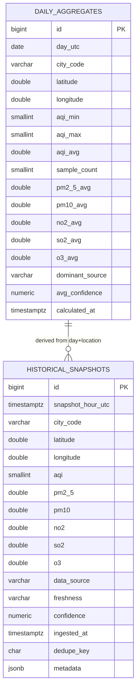

# Historical Data Platform - Schema Design (Issue 1.1)

## Scope
- Hourly canonical snapshots for city and custom coordinate requests.
- Daily aggregates derived from hourly snapshots.
- Provenance fields: `data_source`, `freshness`, `confidence`.
- Unified response contract: provenance is available both as flat fields and in nested `metadata`.
- Export parity: CSV/JSON expose `confidence_explanation`, `fallback_used`, `cache_age_seconds` alongside core provenance fields.

## ER Diagram

## Migration
- SQL migration file: `migrations/001_history_schema.sql`.
- Compatible with PostgreSQL 13+ (uses `JSONB`, `BIGSERIAL`, partial index strategy can be added later).

## Dedupe and Idempotency Basis
- Ingestion should compute `dedupe_key` from:
  - `snapshot_hour_utc` (truncated to hour)
  - location identity (`city_code` or normalized `lat/lon`)
  - source payload fingerprint
- Unique index on `dedupe_key` guarantees idempotent write semantics.

## Retention Plan (Expected)
- Raw hourly snapshots:
  - Keep 18 months online in primary table.
  - Roll to cold storage/archive after 18 months.
  - Hard-delete after 36 months (configurable per compliance policy).
- Daily aggregates:
  - Keep 5 years online for analytics and user-facing trends.
- Suggested partitioning:
  - Monthly partitions by `snapshot_hour_utc` for `historical_snapshots`.

## Read/Write Benchmark Plan (Expected)
- Workload assumptions:
  - 200 canonical cities + up to 3k custom coordinates/day.
  - Hourly write cadence.
- Write target:
  - p95 insert latency < 25 ms for single-row upsert-equivalent write.
  - sustained 150 writes/sec burst for catch-up ingestion.
- Read target:
  - p95 history query (7 days hourly) < 80 ms per city/point.
  - p95 daily aggregate query (30 days) < 60 ms.
- Benchmark method:
  - Use synthetic snapshots with realistic pollutant distributions.
  - Measure with warm cache and cold cache profiles.
  - Record baseline before adding `/history` APIs (Issue 1.3).

## Hourly Anomaly Detection Thresholds (Issue 2.3)
- Detection method:
  - Local rolling baseline by median of the previous `6` hourly AQI points.
  - For each current point, evaluate absolute and relative deviation from baseline.
- False-positive control thresholds:
  - `min_absolute_delta = 35 AQI`
  - `min_relative_delta = 0.55` (55% deviation)
- Classification:
  - `spike` when current AQI significantly above baseline.
  - `dropout` when current AQI significantly below baseline.
- Returned fields in `/history`:
  - `anomaly_detected`
  - `anomaly_type`
  - `anomaly_score`
  - `anomaly_baseline_aqi`
